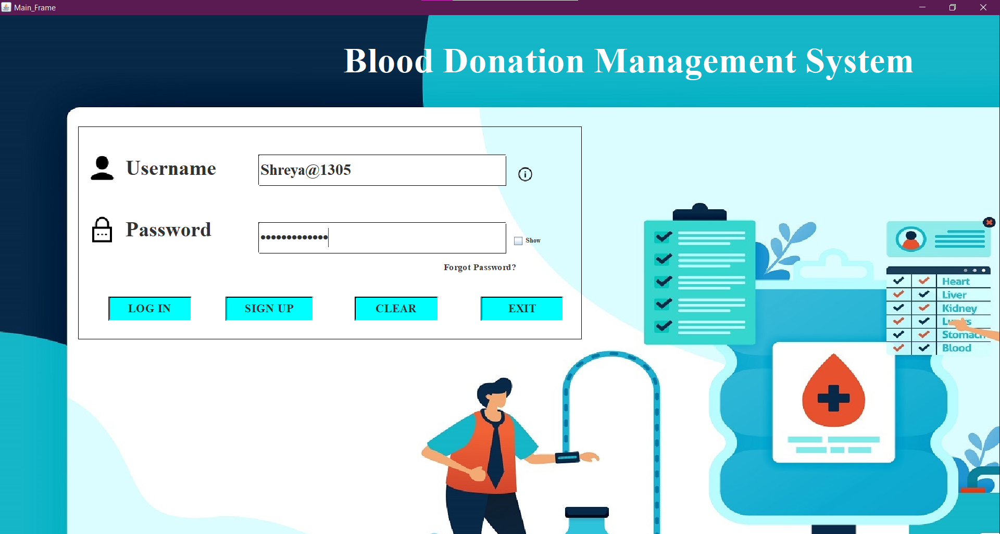
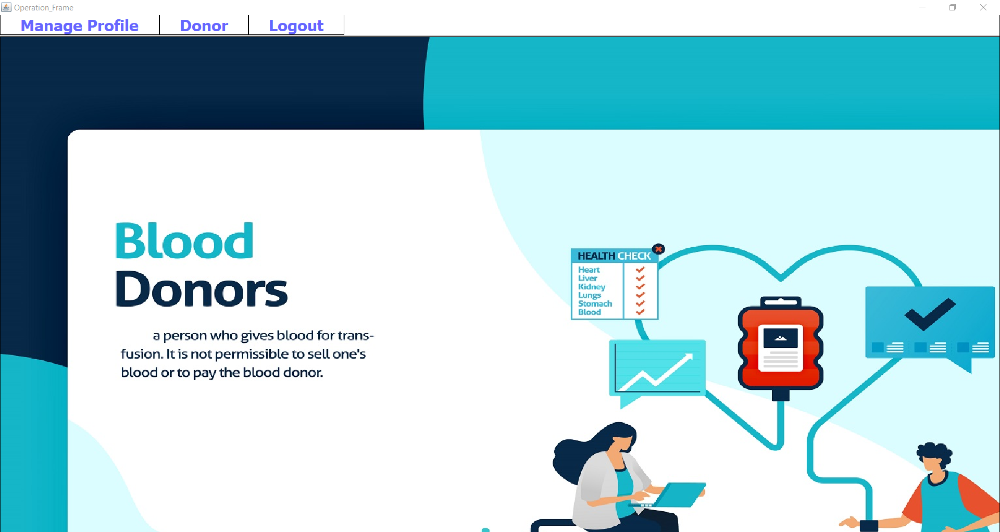
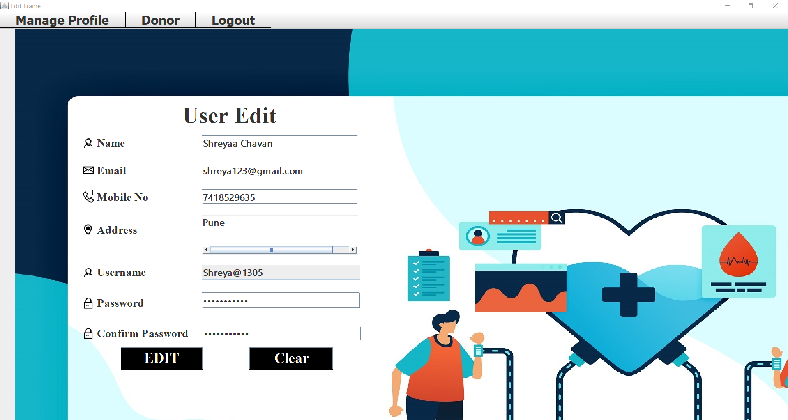
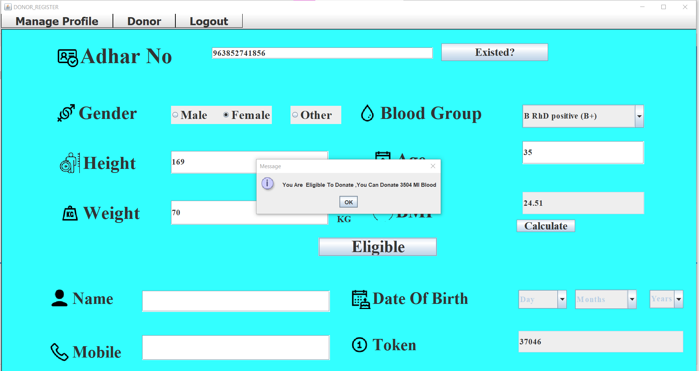
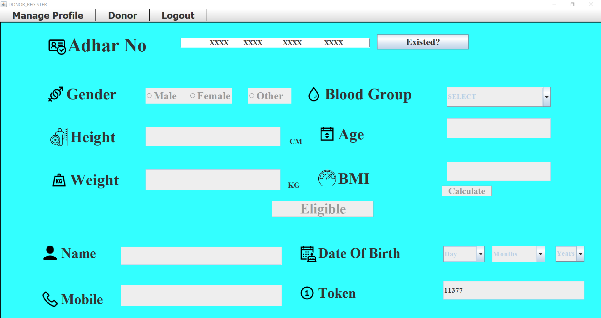
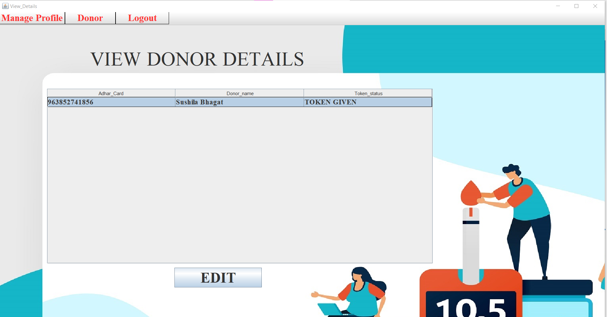
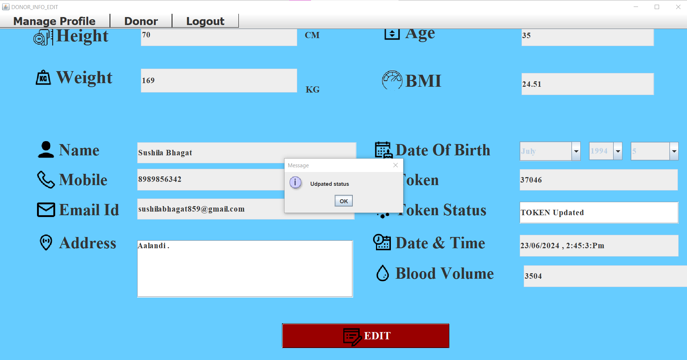

# Blood Donation Management System using Machine Learning (Java Fullstack Desktop Application Development)

## Project Overview
The Blood Donation Management System using Machine Learning project is an ambitious Java Fullstack Desktop Application that revolutionizes the management of blood donation processes. This advanced system employs the power of machine learning algorithms, specifically linear regression, to predict the eligibility of individuals for blood donation.

## Key Features
- Machine Learning Integration: Utilizes linear regression to predict the eligibility of individuals for blood donation.
- Java Fullstack Development: Developed as a desktop application using Java.
- NetBeans IDE: The project is built and managed within the versatile and feature-rich NetBeans Integrated Development Environment (IDE).
- MySQL Database: Uses the MySQL connector for secure and efficient data storage and retrieval.
- Data-Driven: Relies on a curated Blood Data Excel sheet that includes essential data points such as blood volume in milliliters (ml) and Body Mass Index (BMI).

## Screenshots

### Main Screen

### Operation Screen

### Edit Profile Screen

### Prediction Screen

### New Donor Screen

### View Donor Screen

### Updation of Token Screen

## Detailed Description

### Machine Learning Component
The system's machine learning component is designed to predict whether an individual is eligible to donate blood based on key health metrics. The primary features used for this prediction are:
- Blood Volume (ml): The amount of blood in milliliters.
- Body Mass Index (BMI): A value derived from the mass (weight) and height of an individual.
These features are fed into a linear regression algorithm, which has been trained to make accurate predictions regarding blood donation eligibility.

Thank you for your interest in the Blood Donation Management System using Machine Learning
